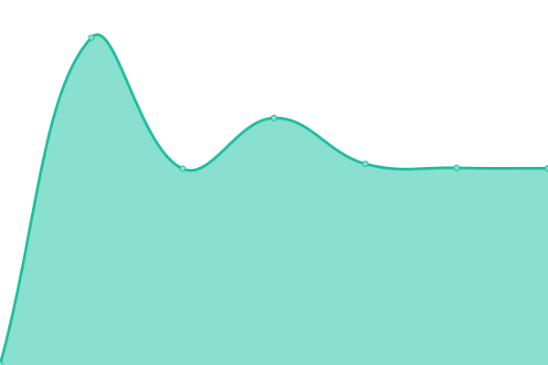
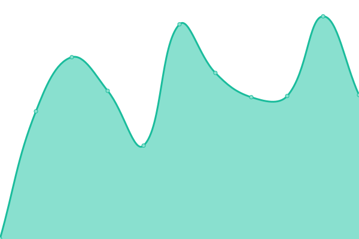

Live status: <!--live status--> **🟩 All systems operational**

<!--start: status pages-->

| URL | Status | History | Response Time | Uptime |
| --- | ------ | ------- | ------------- | ------ |
| [1-2.dev](https://1-2.dev) | 🟩 Up | [1-2-dev.yml](https://github.com/softcreatr/statuspage/commits/main/history/1-2-dev.yml) |  668ms | 
| [SoftCreatR Media](https://www.softcreatr.com/health-check) | 🟩 Up | [soft-creat-r-media.yml](https://github.com/softcreatr/statuspage/commits/main/history/soft-creat-r-media.yml) |  387ms | 

<!--end: status pages-->

Icon made from [Icon Fonts](http://www.onlinewebfonts.com/icon) is licensed by CC BY 3.0
