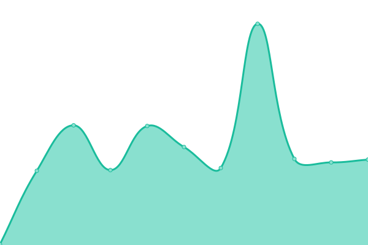
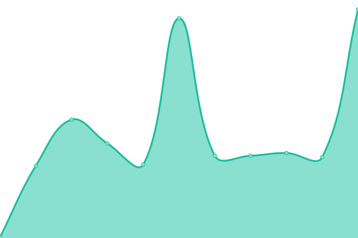
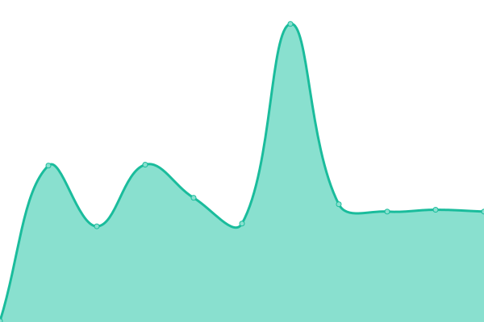

Live status: <!--live status--> **🟩 All systems operational**

<!--start: status pages-->

| URL | Status | History | Response Time | Uptime |
| --- | ------ | ------- | ------------- | ------ |
| [1-2.dev](https://1-2.dev) | 🟩 Up | [1-2-dev.yml](https://github.com/softcreatr/statuspage/commits/main/history/1-2-dev.yml) |  470ms | 
| [SoftCreatR Media](https://www.softcreatr.com) | 🟩 Up | [soft-creat-r-media.yml](https://github.com/softcreatr/statuspage/commits/main/history/soft-creat-r-media.yml) |  805ms | 
| [SoftCreatR Media - PkgSrv 1 - Vortex (WSC 3.0)](https://shop.softcreatr.com/package-server/3.0/) | 🟩 Up | [soft-creat-r-media-pkg-srv-1-vortex-wsc-3-0.yml](https://github.com/softcreatr/statuspage/commits/main/history/soft-creat-r-media-pkg-srv-1-vortex-wsc-3-0.yml) |  731ms | 
| [SoftCreatR Media - PkgSrv 2 - Tornado (WSC 3.1)](https://shop.softcreatr.com/package-server/3.1/) | 🟩 Up | [soft-creat-r-media-pkg-srv-2-tornado-wsc-3-1.yml](https://github.com/softcreatr/statuspage/commits/main/history/soft-creat-r-media-pkg-srv-2-tornado-wsc-3-1.yml) |  332ms | 
| [SoftCreatR Media - PkgSrv 5 - Hurricane (WSC 5.2)](https://shop.softcreatr.com/package-server/5.2/) | 🟩 Up | [soft-creat-r-media-pkg-srv-5-hurricane-wsc-5-2.yml](https://github.com/softcreatr/statuspage/commits/main/history/soft-creat-r-media-pkg-srv-5-hurricane-wsc-5-2.yml) |  277ms | 
| [SoftCreatR Media - PkgSrv 6 - 5.3](https://shop.softcreatr.com/package-server/5.3/) | 🟩 Up | [soft-creat-r-media-pkg-srv-6-5-3.yml](https://github.com/softcreatr/statuspage/commits/main/history/soft-creat-r-media-pkg-srv-6-5-3.yml) |  159ms | 

<!--end: status pages-->

Icon made from [Icon Fonts](http://www.onlinewebfonts.com/icon) is licensed by CC BY 3.0
